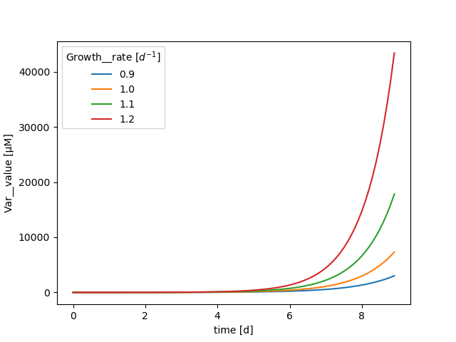

# xarray-simlab-ode

 [](https://xarray-simlab-ode.readthedocs.io/en/latest/?badge=latest)


The `xso` framework for building and solving models based on ordinary differential equations (ODEs), an extension of [xarray-simlab](https://github.com/xarray-contrib/xarray-simlab).

Xarray-simlab provides a generic framework for building computational models in a modular fashion and an [xarray](http://xarray.pydata.org/) extension for setting and running simulations using xarray's `Dataset` structure.

Xarray-simlab-ode (XSO) extends the framework with a set of variables, processes and a solver backend, suited towards ODE-based models. It is designed for flexible, interactive and reproducible modeling workflows.

## Installation

```bash
$ pip install xso
```

## In a nutshell
A highly simplified model based on ordinary differential equations is shown below.
1. Create new model components by writing compact Python classes:
```python
import xso

@xso.component
class Variable:
    var = xso.variable(description='basic state variable', attrs={'units':'µM'})

@xso.component
class LinearGrowth:
    var_ext = xso.variable(foreign=True, flux='growth', description='external state variable')
    rate = xso.parameter(description='linear growth rate', attrs={'units':'$d^{-1}$'})

    @xso.flux
    def growth(self, var_ext, rate):
        return var_ext * rate
```
2. Create a new model just by providing a dictionary of model components:

```python
model = xso.create({'Var':Variable,'Growth':LinearGrowth}, time_unit='d')
```
3. Create an input xarray.Dataset, run the model and get an output xarray.Dataset:

```python
import numpy as np

input_ds = xso.setup(solver='solve_ivp',
                     model=model,
                     time=np.arange(1,10,.1),
                     input_vars={
                         'Var':{'value_label':'X', 'value_init':1},
                         'Growth':{'var_ext':'X', 'rate':1.},
                     })

with model:
    output_ds = input_ds.xsimlab.run()
```
4.Perform model setup, pre-processing, run, post-processing and visualization in a functional style, using method chaining:
```python
with model:
    batchout_ds = (input_ds
     .xsimlab.update_vars(
         input_vars={'Growth': {'rate': ('batch', [0.9, 1.0, 1.1, 1.2])}}
     )
     .xsimlab.run(parallel=True, batch_dim='batch')
     .swap_dims({'batch':'Growth__rate'})
     .Var__var_value.plot.line(x='time')
     )
```


## Documentation

Documentation is hosted on ReadTheDocs: [https://xarray-simlab-ode.readthedocs.io](https://xarray-simlab-ode.readthedocs.io/en/latest/)

## Contributing

The package is in the early stages of development, and contributions are very welcome. See GitHub Issues for specific issues, or raise your own.
Code contributions can be made via Pull Requests on GitHub.
Check out the contributing guidelines for more specific information.

## License

xarray-simlab-ode was created by Benjamin Post. 
It is licensed under the terms of the BSD 3-Clause license.

## Credits

Xarray-simlab-ode is an extension of [xarray-simlab](https://github.com/xarray-contrib/xarray-simlab), created by Benoît Bovy.
